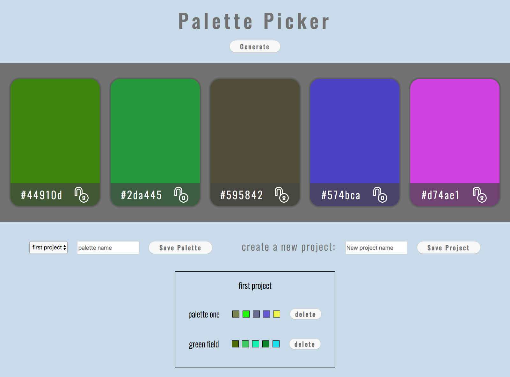

# Palette Picker 

 

 

This app enables you to generate a random palette of 5 colors. Colors can be locked and the rest of the color swatches shuffled. Projects can be saved as well as palettes. One project may have many palettes.

The project features a jQuery client side, a Node.js + Express.js server and postgreSQL database.    

### An app for choosing palettes inspired by [Coolers] (https://coolors.co/app).

### A live version of this project is deployed [here](https://palette--picker.herokuapp.com/).

## Libraries Utilized  

* jQuery
* PosgreSQL
* Node.js
* Express.js
* Knex.js
* Chai
* Mocha

## Getting Started 

#### Clone down this repository. 

`git clone https://github.com/PreciseSlice/palette-picker`

#### cd into the repository and install dependancies.

`cd palette-picker`

`npm install`

#### To start the server.

`npm start`

#### To run the test suite.

`npm test`

## Using the app

### Generate a Palette

Click the generate button or press space bar for a new set of random color swatches.

  

 

### Lock a Color

Click on a color swatch to toggle the lock.

 

### Save a Project 

Enter the project name and hit save to create a new project. 

 

### Save a Palette

Select the project to save the palette to and then input the name of your palette.

